# レシピ検索 WEB アプリケーション　【Next.js / React / Node.js / TypeScript / MongoDB / Docker / GCP / Vercel / Render】

## はじめに

---

レシピ検索アプリーション Good Food を解説した記事となります。

---

### レシピを検索して投稿、交流できるウェブアプリケーション【GOOD FOOD]

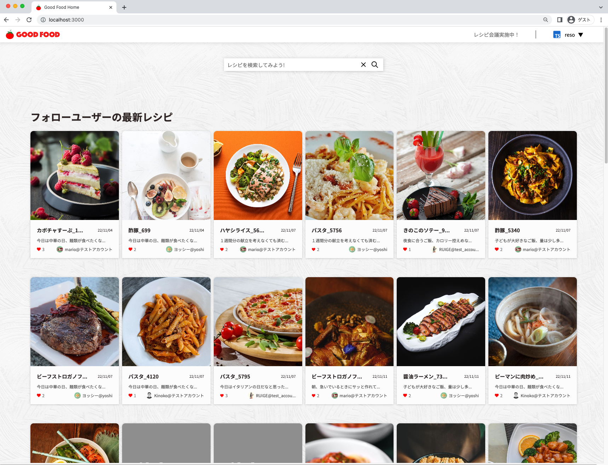

主な使用技術はフロントエンドに Next.js/TypeScript、バックエンドに Node.js/TypeScript、データベースに MongoDB、ストレージに GCP の Cloud Storage、コンテナ作成に Docker、デプロイサービスはフロントエンドを Vercel、バックエンドは GCP の Cloud Run または Render を使用。

### 目次

1. アプリケーションの概要
2. 企画
3. スケジュール
4. デザイン
5. 前回の反省点
6. アプリの機能
7. 使用した技術スタック
8. 努力した点、難しかった実装
9. どのように学習したか
10. 今後の学習

### 開発者について

---

- 12 年間コンピューターグラフィックスを使用した業界で映画や、TV、CM、ゲーム映像などの仕事に従事していました
- 趣味で 4，5 年程度 UNREAL ENGINE を使用したゲーム開発をしており、iOS に公開した経験もあります
- 2022 年から本格的にプログラミングにのめり込み転職も検討中
- 一歳になる子どもがいます
- 以前台湾に 2 年ほど仕事で住んでいたことがあり中国語を話すことができます

## 1. アプリの概要

---

- 登録してログインしてみよう
- レシピを登録する
- ページを作成する
- レシピを印刷する


web サイトはこちら

👉 [https://good-food-one.vercel.app/](https://good-food-one.vercel.app/)

Good Food はレシピを投稿しお気に入りのレシピを保存、クリエイターをフォローすることができるアプリケーションです。
企画の項目で詳しく述べますがレシピの内容を印刷して使うことを目的として開発したので印刷に特化したレイアウトで出力できます。

### まずは登録してみよう

<div align="center">

</div>

アカウント名、メールアドレス、パスワードを送信すると登録したメールアドレスに確認のメールが届きます（現在はメール送信サービスを中断していますのでそのままログインすることが可能です）。
登録後はログインしてみましょう！ 👏👏👏

### レシピを登録する

<div align="center">

</div>

**記入項目は**

- レシピのタイトル
- レシピの説明
- 画像のアップロード
- 調理時間
- 材料と分量
  - 複数作成することが可能です
- 調味料と分量
  - 複数作成することが可能です
- 手順
- タグ

レシピを登録したら自分のレシピを確認してみましょう！
レシピに対してコメントすることもできます。

<div align="center">

</div>

### ページを作成する

<div align="center">

</div>

#### ページ機能とは？

ページとは複数のレシピをグループ化する機能です。
ページという名前から一枚のページ（A4 用紙を想定）にレシピを詰め込んで印刷、または PDF にして使用します。
分割数は現在 1, 4, 6 の 3 種類のみとなっています。

### レシピを印刷する

**６分割の場合**

<div align="center">
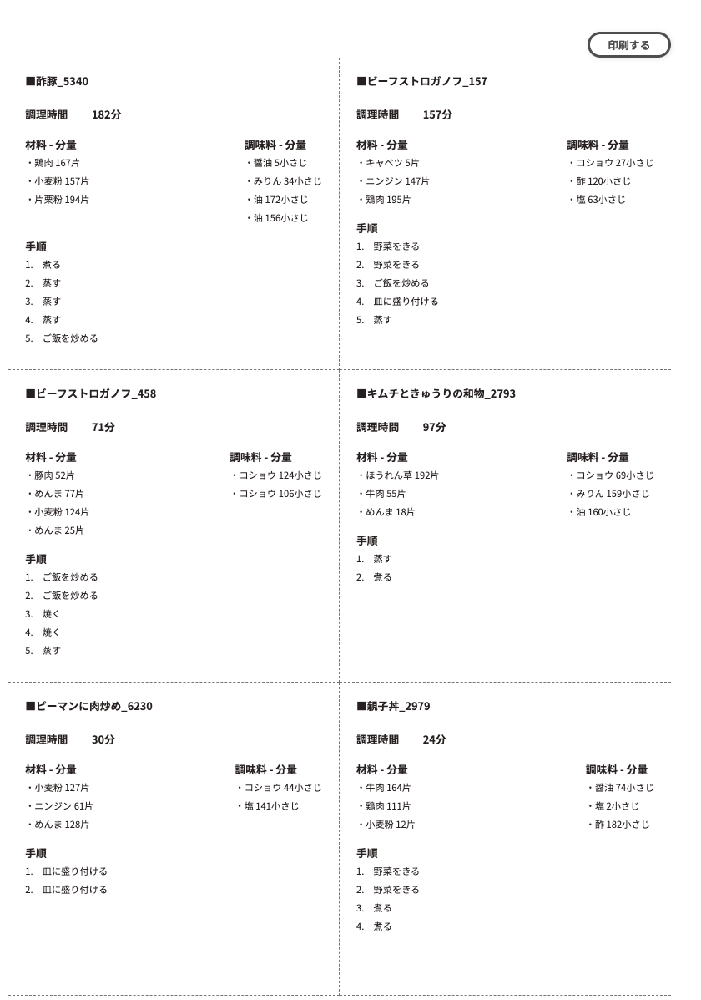
</div>

**4 分割の場合**

<div align="center">
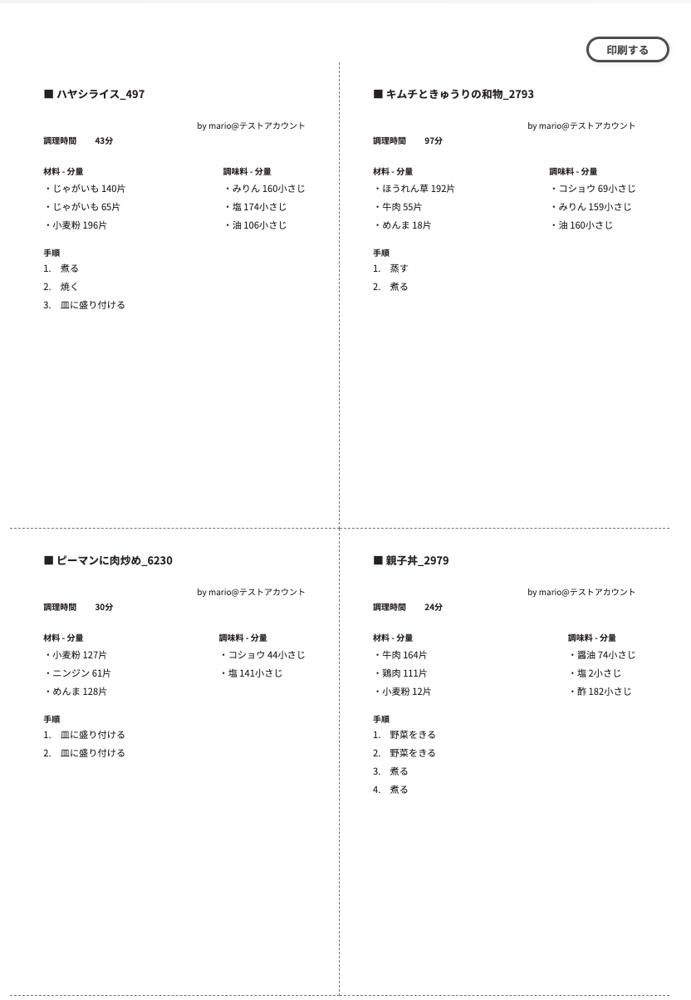
</div>

## 2. 企画

---

- きっかけ
  - 印刷できるサイトはないのか
  - chrome の印刷オプションで分割レイアウトは可能では？
- コンセプト

### きっかけ

このアプリを作ろうとしたきっかけは私の妻が料理をしている際にそのとき使用していたレシピ検索アプリの不満を述べたことが始まりでした。

- レシピをノートに全部手書きすることは面倒

- 料理をしているときにスマートフォンを開きたくない

  - 料理をしているときは手が濡れていたり汚れているため 画面を触りたくない
  - スマホの画面は一定時間経過すると画面がオフになるのでその度に立ち上げるのが面倒
  - 自分のメモが記入できない

- 自分のレシピノートが作成したい
  - 大きいノートは台所では邪魔になる為小さいノート、A6 サイズに貼り付けできるサイズが良い
  - メモができるある程度の余白が欲しい

#### 印刷できるサイトはないのか？

印刷できるサイトはありますが基本的に単品のレシピのみで A4 サイズに印刷するサイズのみを取り扱っているところがほとんどでした。

#### 印刷のオプションで一枚あたりのページ数を変更すれば分割したレイアウトをわざわざ作成する必要はないのではないか？（chrome では可能）

その通りだと思います。ただこの方法だと元々 A4 　フルサイズでレイアウトしていたページを縮小することになるので分割数によっては文字が非常に小さくなります。

### コンセプト

以上の内容を含めてその他の要望をまとめる以下のようになりました

<u>**レシピを印刷して自分のマイレシピノートを作成しよう！**</u>

- 印刷ができる
- 印刷のオプションがある
  - 分割数のオプション
- 印刷ができればそれ以外はシンプルなものでよい
- 複雑な機能は必要ない
- 綺麗で見易いサイト

最初の設計段階でフォローしているユーザー同士、メッセージを送ることができる機能も考えておりました。そのような機能は必要ないと判断されたため、ボツにしました。

## 3. スケジュール

---

スケジュールは 9 月の頭から開発を開始。当初の予定では１ヶ月で終わらせることを目標にしていましたが、新技術を使用するという目的があったため勉強の時間に費やす時間が増え結果的には 2 ヶ月程度かかりました。この 2 ヶ月はあくまでアプリケーションの機能開発の期間であるため、デプロイメント後の修正、テストの時間は含まれておりません。

- サーバー側の開発：２週間
- クライアント側の開発：1 ヶ月半程度（CSS、レスポンシブ対応含む）
- Web デザインの作成１週間程度

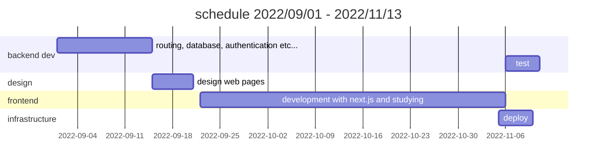

スケジュールを見てわかるようにフロントエンドの開発に非常に時間を費やしております。これは Next.js と TypeScript を新しく導入したことにより Next.js の勉強と試行錯誤に時間を取られた為です。
実際バックエンドの開発後すぐにフロントエンドの開発に取り掛かれるよう React/Next.js の勉強には 9 月頭からバックエンドの開発と同時に行っておりました。
バックエンドも TypeScript を導入していますが TypeScript の勉強自体は 7 月の時点から始めていたためスムーズに進められたと考えております。

## 4. デザイン

---

- デザインは **AdobeXD** を使用して大まかなデザイン案を作成
- 当初はグラデーションを使用したリッチなデザインを考えておりましたがあまり合わないと感じたためポップ寄りに変更しました。
- 配色は赤と白をベースに緑をアクセントとしたデザインで最終的には落ち着きました。

### サイトデザイン全体図（構想図）

- 上部の縦長サイズはモバイル用レイアウト

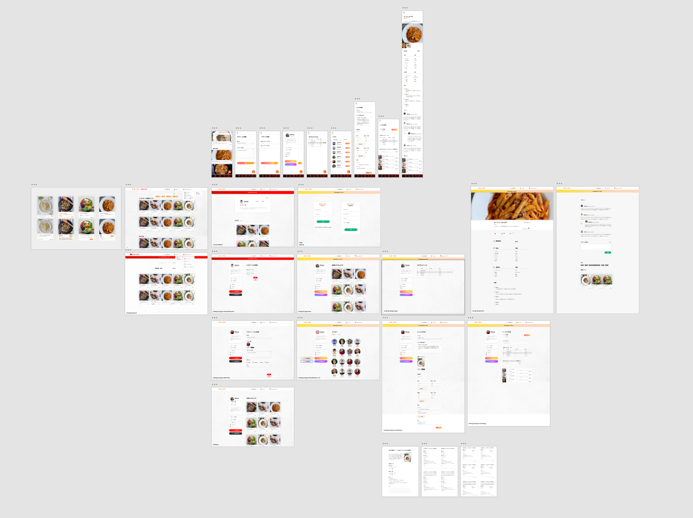

#### レシピカードの構想案

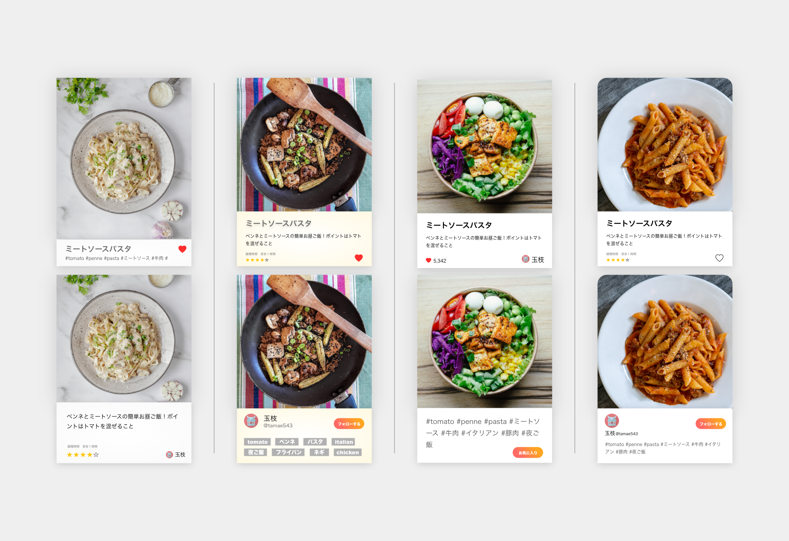

#### ホームの構想案

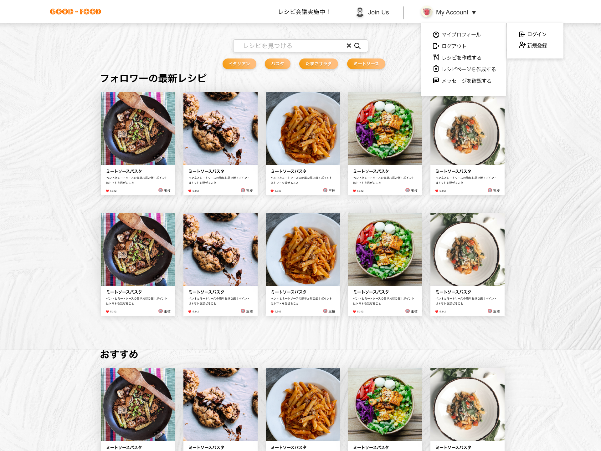

#### モバイルサイトの構想案、全体図

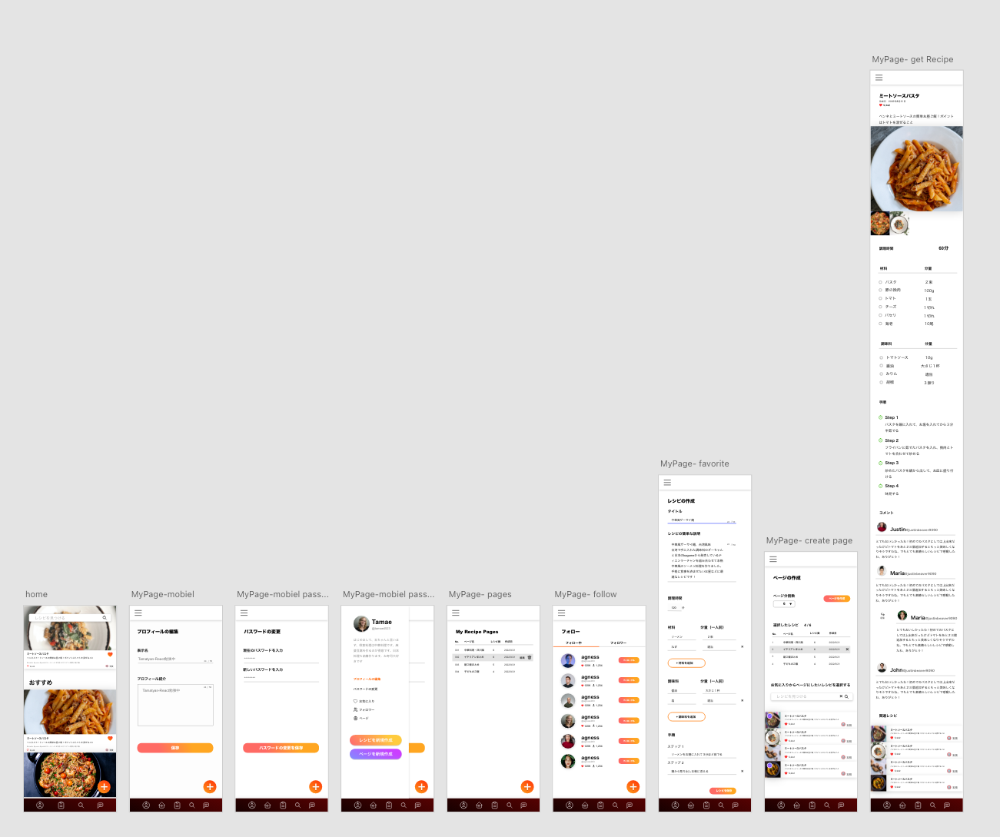

#### 印刷時のレイアウト構想案

左から 1 分割、4 分割、6 分割

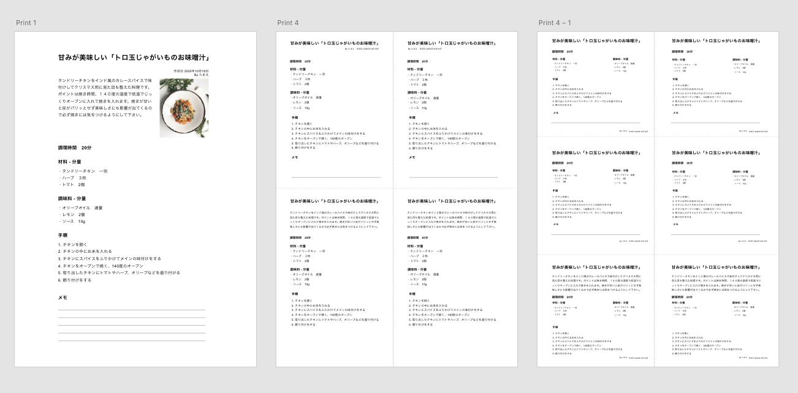

#### 全体のバランス調整チェック、配色、ボタンデザイン

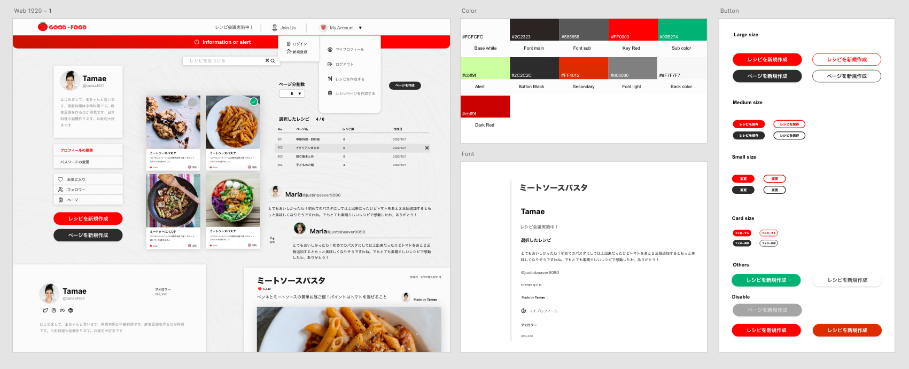

## 5. 前回の反省点

---

#### 開発の効率化

前回はアプリケーションを手探りで開発していった為、サーバー側の開発とクライアント側の開発を並行して進めて行きました。しかしこの方法はどちらかの側の開発に集中できないため開発効率がよくありませんでした。
一方今回は全体の作り方をある程度把握しているので、最初にバックエンドの機能に集中して取り組み、Postman を使用してルーティングなどのチェック、デバッグ、テスト（手動テスト）を行いました。
その後デザイン、フロントエンドの開発と順次進めていくスケジュールをとっています。

#### セキュリティ

前回はクライアント側の js ファイルに、バックエンドへの API の URL が丸見えの状態であったのでこれをどうにかしたいと考えておりました。
フロントエンドは Next.js を使用することを検討していましたが、その Next.js の API Routes を使用すればバックエンドへの URL を隠蔽することができます。

#### データベース設計

データベースは前回と同様、今回も MongoDB を使用しております。前回はコレクションを細かく分けなかったためスケールしたとき、アカウントを削除したときの不具合の原因を見抜くことができませんでした。

例えば、MongoDB のコレクションのスキーマは JSON オブジェクトのように階層（埋め込み）を作ることができるので、一つのドキュメントにどのようなデータも加えることができます。しかし MongoDB は一つのドキュメントに 16MB までの制限があるため、スケールしていくと必ずこの問題にぶつかることになります。

また、一つのドキュメントに全てのデータを入れるとアカウントを削除した際のシステムの負荷非常に大きくなります。このような理由があるため分けて作るようにしました。

#### N+1 問題

前回のアプリでは一つのサーバーへのリクエストに対して何度も DB にアクセスするような処理を記述していました。加えて DB から受け取った内容をさらに整形しクライアント側に渡す処理を Node.js 上で記述しており、とにかく無駄が多かったです。
今回はそのような無駄をできる限り排除できるようにほぼ全ての DB へのクエリに Aggregation のパイプラインを使用し、一度のクエリで必要なデータを全て返すよう記述する努力をしました。Mongoose では$project のオペレーター を使用するため DB から渡ってきたデータを Node 上で整形することなくそのままクライアント側に返すことができます。

## 6. 機能

---

- 実装内容
- ページ遷移図
- データベース設計

### 主な実装内容

- サインアップ、ログイン、ログアウト
- ユーザーの認証、ユーザー情報の取得
- プロフィールの編集
- パスワードの変更
- メールアドレスの変更
- アカウントの削除
- レシピの検索
- レシピの投稿
- レシピの編集、削除
- レシピのお気に入り登録、削除
- 関連レシピの取得
- レシピへのコメント
- ユーザーのフォロー
- ページの作成、編集、削除
- メール認証
- Cloud Storage へ画像の保存
- JWT による認証
- パスワードの hash 化
- デバッグ
  - ランダムユーザーの作成
  - レシピの自動作成
  - 自動お気に入り登録
- レスポンシブ、モバイル対応

### ページ遷移図

#### 全体像

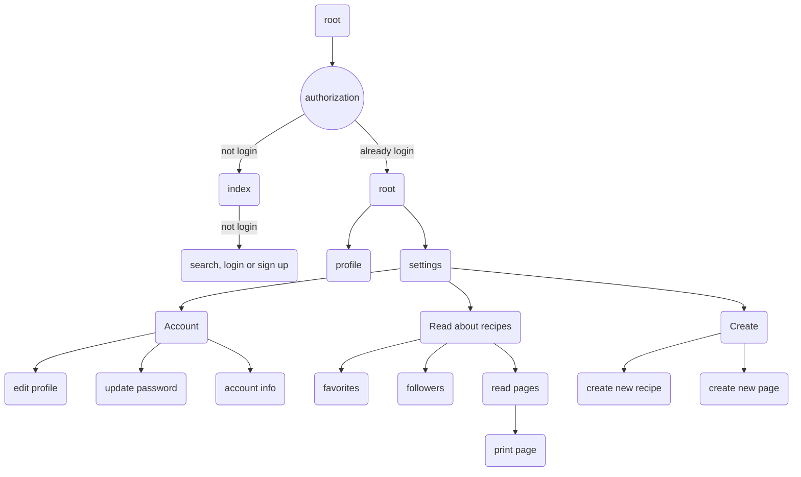

### ルーティング一部

### データベース設計

- 使用した DB
- 概念図
- スキーマサンプル

#### 使用した DB

**MongoDB / MongDB Atlas**

前回同様データベースには MongoDB を使用しております。
MongoDB は前回の経験を活かせるということ、Aggregation パイプラインを使用した処理を学びたいという理由から選びました。

開発の初期段階ではローカルマシン上の MongoDB を使用し、開発後期ではホスティングサービスである MongoDB Atlas に切り替えて開発を行いました。

#### 概念図

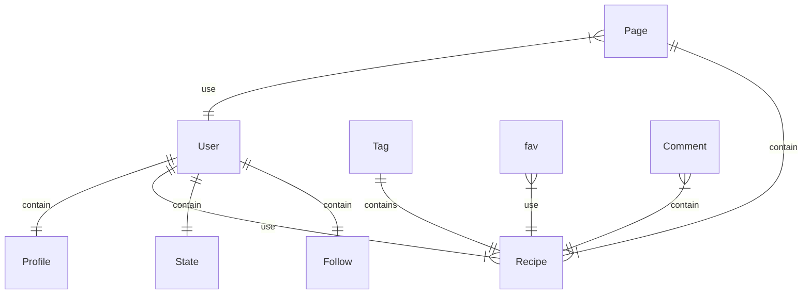

#### スキーマ サンプル

**Recipe**

| field       | type   | Null     | key     | Default | Extra             |
| ----------- | ------ | -------- | ------- | ------- | ----------------- |
| \_id        | object | Not Null | primary | auto    |                   |
| owner       | object | Not Null | FK      | auto    | owner             |
| title       | String | Not Null |         |         |                   |
| describe    | String |          |         |         |                   |
| cookTime    | number |          |         |         |                   |
| img         | String |          |         |         |                   |
| ingredients | Array  |          |         |         | parent            |
| - name      | String |          |         |         | ingred name       |
| - amount    | String |          |         |         | ingred num        |
| flavors     | Array  |          |         |         | parent            |
| - name      | String |          |         |         | flavor name       |
| - amount    | String |          |         |         | flavor num        |
| step        | Array  |          |         |         | parent            |
| -           | String |          |         |         | step description  |
| timestamps  | Date   |          |         |         | create and update |

```typescript
import { model, Model, Schema, Types, Document } from 'mongoose'

//  Recipeモデルの型を定義
export interface RecipeFields extends Document {
  _id: Types.ObjectId
  owner: Types.ObjectId
  title: string
  describe: string
  cookTime: number
  img: string
  ingredients: { name: string; amount: string }[]
  flavors: { name: string; amount: string }[]
  steps: string[]
  timestamps: Date
}

const recipeSchema = new Schema<RecipeFields>(
  {
    owner: {
      type: Schema.Types.ObjectId,
      required: true,
      ref: 'User',
    },
    title: {
      type: String,
      required: true,
    },
    describe: {
      type: String,
    },
    cookTime: {
      type: Number,
    },
    img: {
      type: String,
    },
    ingredients: [{ name: { type: String }, amount: { type: String } }],
    flavors: [{ name: { type: String }, amount: { type: String } }],
    steps: [{ type: String }],
  },
  { timestamps: true }
)

const Recipe = model<RecipeFields>('Recipe', recipeSchema)

export default Recipe
```

## 7. 使用した技術スタック

---

### フロントエンド

| 名前            | version          |
| --------------- | ---------------- |
| Next.js / React | 12.3.0 (Next.js) |

#### 使用した 主な npm モジュール

| 名前                  | version     |
| --------------------- | ----------- |
| @google-cloud/storage | 6.5.2       |
| axios                 | 0.27.2      |
| cookie                | 0.5.0       |
| multer                | 1.4.5-lts.1 |
| nanoid                | 4.0.0       |
| next-connect          | 0.13.0      |
| nookies               | 2.5.2       |
| react                 | 18.2.0      |
| react-hook-form       | 7.36.0      |
| sharp                 | 0.31.1      |

Next.js を採用した理由は Next の pages を利用したルーティング機能に魅力を感じたからです。
フロントエンドのフレームワークは React が非常に人気であるため覚えておく必要があると考えました。

### バックエンド

| 名前              | version  |
| ----------------- | -------- |
| Node / TypeScript | v16.16.0 |

#### 使用した 主な npm モジュール

| 名前           | version |
| -------------- | ------- |
| express        | 4.17.13 |
| bcryptjs       | 2.4.2   |
| jsonwebtoken   | 8.5.1   |
| mongoose       | 6.5.4   |
| @sendgrid/mail | 7.7.0   |

バックエンドは TypeScript を導入したこと以外、前回から大きな変化はありません。
基本的な TypeScript の内容しか勉強していなかったため、導入当初はライブラリのメソッドの型をどのように記述するか非常に困った覚えがあります。その際は公式のドキュメントやブログ、StackOverflow などからどのように書くか学びました。

### インフラ

| 名前                | url                                    |
| ------------------- | -------------------------------------- |
| GCP / Cloud Storage | https://cloud.google.com/storage?hl=ja |
| Docker              | https://hub.docker.com/                |
| GCP / Cloud Run     | https://cloud.google.com/run?hl=ja     |
| Vercel              | https://vercel.com                     |
| Render              | https://render.com/                    |

Next.js 製のフロントエンドソースコードは Vercel にデプロイし、
バックエンドは当初は Render を使用していましたが応答速度が無料枠だと非常に遅く、日本のリージョンもないため Cloud Run に途中で変更しました。

### その他

- Git / Github

今回の案件からプルリクエストで main ブランに merge してく方式を導入しました。
vercel への継続的デプロイもプルリクエストで main ブランチへ merge された際トリガーが発動するようにしています。

### システム構成図

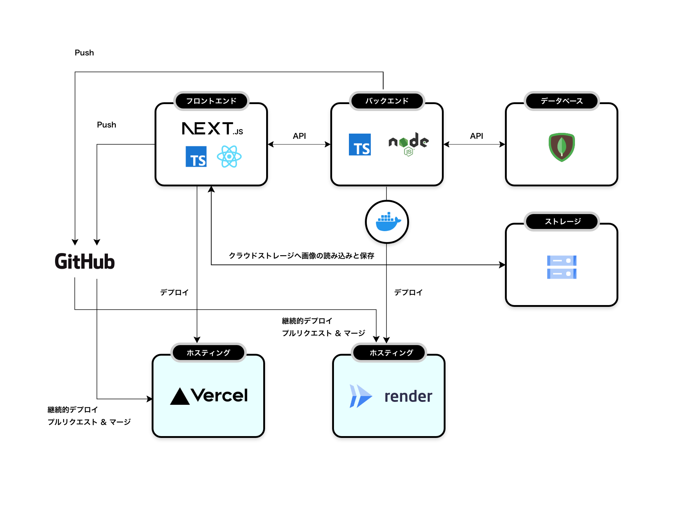

### 使用ツール

- vscode
- postman
- MongoDB Compass
- Adobe XD
- Adobe Illustrator

- アイコンフリー素材
  - [tabler](https://tabler-icons.io/)

エディタは vscode を、バックエンド機能の開発では CRUD 操作、ルーティング、デバッグ などの確認で postman を使用。
データベースの操作に関してはローカル環境での開発の際はターミナルから Mongosh を立ち上げ、Atlas に切り替えた後 MongoDB Compass を使っています。

主なアイコンはフリー素材を利用させていただいておりますが、web のデザインやロゴ、一部のアイコン制作には Adobe の XD とイラストレータを使用しました。

## 努力した点、難しかった実装

- TypeScript の導入
- Next.js / React の導入
  - Next のバックエンド API routes
  - React の rendering のタイミング、SPA の理解
- mongoDB で aggregate pipeline のクエリの記述

前回の[俳句投稿アプリ](https://github.com/AkihitoNakano/Portfolio-Paiku575)では努力した実装、難しかった実装としてセキュリティ周り、エラーハンドリング、API の作成、レスポンシブ対応、DB の設計、メール認証、アカウント削除の処理を挙げておりますが、これらの部分に関しては前回からの引き継ぎと改善を行っているためそこまで問題にはなりませんでした。

今回の案件では主に言語とフレームワーク周辺での困難が多かったと認識しております。

### TypeScript の導入

TypeScript を導入した理由はネットでのエンジニア皆様の意見で、TypeScript を使用するべきという声が多くなったと感じたからです。チーム制作では堅牢で可読性の高いコードを記述する必要があり、今後仕事で利用することが増えるだろうと考え導入に踏み切りました。

導入直後は記述の多さや新しい機能の理解で非常に苦労しましたが、今では TypeScript なしでは開発できないようになりました。

#### クラスを使用するべきか悩み結局ほとんど利用せず

TypeScrip でのクラスの機能は一つの目玉の機能であるためクラスをどこかで使用したいと考えておりました。実際バックエンドの開発初期の段階でいくつかの処理をクラスで記述しました、しかし使用しているうちに関数の方が簡潔でわかりやすいと思ったため結局その後はクラスを使わずほとんどを関数で処理しています。

**どのような場面で使用したか**

**サーバー側**

- レシピ投稿のリクエストが来たらレシピのデータを受け取り登録する

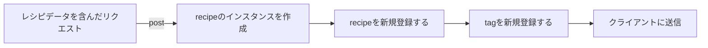

このレシピのクラスにはレシピの取得、登録、編集、削除などのメソッドが含まれています。またエラーが起こった際の処理もこのメソッドに記載しました。

クラスをこの場面で使う必要があるのかと考えた理由は、サーバー側ではリクエストを受け取ってからデータを取得し返すまでのライフサイクルが短いので受け取ったデータをクラスのインスタンスにして変数に格納する必要がほとんどないと感じたためです。

またレシピのクラス内ではレシピを処理する内容しか書いていないのでレシピ以外のモデルで関係する部分を記述しようと思うとまた別のクラスや関数を呼び出す必要がありました。
例えば上記のレシピ登録の場合はレシピを登録した後タグ情報を別のモデルに登録する必要があるのですが、そうするとインスタンスを作るよりも処理に応じて関数で作ったほうが他の処理でも使いやすいと考えました。

その他にはクラスのコンストラクタでは async/await が使用できないため async/await を使う処理を書こうと思うと記述が複雑になることも理由の一つです。

エラー処理などではクラスを使って処理を記述している部分もありますが、今回サーバー側の用途ではあまりうまく使えなかったため、今次回使用機会をうかがいたいと思います。

### Next.js / React の導入

#### Next.js のバックエンド機能

next.js には next の側でバックエンドの機能（node)を持っており API routes はこのバックエンドの機能の一つです。
API routes はサーバーを通しているためクライアント側からは情報を隠蔽することができます。またサーバー側の処理となるため バックエンドにリクエストする際 CORS の処理を書く必要がありません。

API routes にはこのようなメリットがあるのですが開発を続けていく中で一つ疑問が出てきました。

クライアントから API routes へ api を飛ばし、それをまたバックエンドに飛ばすことになるため、API の処理が一つ増え、それによりエラーやバグの原因が増えていることに気づきました。

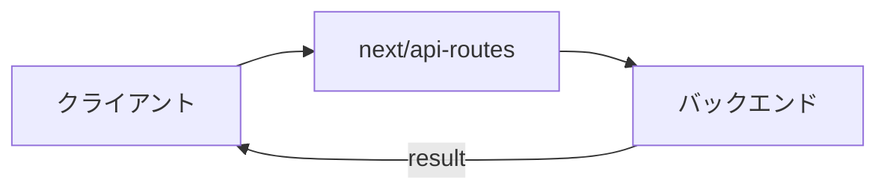

では記述を少なくするためにバックエンドの内容を API routes に移行してよいのかどうか悩みましたが今回は一部の処理のみをサーバーのバックエンドから next の api routes に移行するにとどめました。

その理由は既にバックエンドの開発は大半を終えており、いまさらフロントエンドに移行するとなるとコストが非常にかさむためでです。またバックエンドは JSON データを返すだけのバックエンドの機能として独立させたいからになります。

API routes に移行した一部の処理とは画像データを Cloud Storage にアップロードする部分になります。
画像ファイルのストレージへのアップロードは DB と直接的には関係がない（必要なのはアップロード先の URL のみ）、もう一つの理由は form-data にした画像ファイル はサーバー側ではそのままパースできず api routes からさらにバックエンドに送るまでの実装が非常に難しかったからです。
この部分は middleware を使った処理で解決しました。next.js のバックエンドは node であるので multer や画像変換する sharp を使用することができ、サーバーのバックエンドと同様の処理を書くことができました。

### React は難しいが面白い

React は画面が更新されるタイミングなどを理解することが当初は難しく感じました。また基本的にリロードは行わないため next/router の useRouter で画面遷移を行う場合、特に URL のクエリを変えただけでは画面が切り替わらず悩んだ覚えがあります。

パフォーマンスに関しては確かに vanilla の JavaScript で書いたものと比べると若干少し遅いと感じます、そのため memo や useMemo, useCallback を使ったパフォーマンスチューニングをする必要がありますが、今回は memo のみを使用して改善を行いました。

JSX は HTML ではなくプログラミングを書いている感覚で非常に楽かったです。

### MongoDB Aggregation pipeline を使ってクエリを書く

今回 MongoDB を使用するにあたっての課題は Aggregate を使いこなすことでした。
特に N ＋ 1 問題を解決するために必要な情報を一回で、必要な形で受け取るためにどのように記述するのか調べました。

MongoDB の日本語での情報は非常に少なく、英語文献で調べることが多かったです。公式ドキュメントや Udemy のチュートリアルをよく活用させてもらいました。

MongoDB の Aggregate を使ったクエリは SQL と異なり上から順に処理されていく（stage を順に処理していく）ためわかりやすいのが特徴です。
ただオペレーターと呼ばれる処理のメソッドの記述の仕方に癖があり、慣れるまで非常に苦労しました（今もあまり慣れていません...)。

今回のプロジェクトではレシピのデータ、詳しく述べると検索一覧などで表示されるレシピのカード、を取得するクエリ文の関数が最も多く、基本の型を覚えてしまえば後は似たような文を繰り返すだけでした。

よく使用するオペレータが以下になります

- $match
- $project
- $lookup
- $replaceRoot
- $sort
- $limit
- $skip
- $group
- $unwind
- $in
- $regex
- $mergeObjects
- $arrayElemAt

一点残念なところは aggregate を使った処理は記述が非常に長くなり（一つのクエリで大体 30 行前後）、同じような内容の stage でも再利用することができないためクエリの全体の行数が多くなってしまうことでしょうか...

課題もあります。

現在検索の処理は正規表現を使った部分テキストサーチになるのですが、現在のコードでは複数の単語検索に対応できていません。
これをフルテキストサーチではなく部分テキストサーチで複数単語対応できるようにしたいと模索しております。
調べた中で方法が一つああります。mongoDB Atlas の serverless function を使うことで解決できるのですが問題もあり、検索に 2-3 秒かかってしまうため、使い勝手を考えるとこの方法をとることができませんでした。

mongoDB はおもしろいですが今後は Prisma や SQL を使うことも検討しています。

## 9. どのように学習したか

### TypeScript

**Udemy の【世界で 7 万人が受講】Understanding TypeScript 日本語版**
https://www.udemy.com/course/understanding-typescript-jp/

TypeScript は殆どこちらから学び、後は youtube やネットのドキュメントを必要に応じて参照しておりました。

<div align="center">

</div>

### React \ Next.js

**Udemy の【2022 年最新】React(v18)完全入門ガイド｜ Hooks、Next.js、Redux、TypeScript**
https://www.udemy.com/course/react-complete-guide/

React/Next.js は同じく Udemy から上記の教材で大半を学習しました。
Next.js の項目は少ないため、youtube やネットの記事をも必要に応じて参考にしています。

<div align="center">
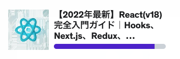
</div>

基本的な TypeScript などの説明の部分は飛ばしています。

### MongoDB

**Udemy の MongoDB - The Complete Developer's Guide 2023**
https://www.udemy.com/course/mongodb-the-complete-developers-guide/

mongoDB も同じく Udemy から上記の教材を使って大半を学習しました。
上記のチュートリアル以外では公式のドキュメントをよく利用しています。

<div align="center">
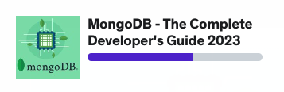
</div>

operator, Aggregate の学習にフォーカスしたため全体の進捗は進みがよくありません...

それ以外では今回のプロジェクトでは使用しませんでしたが **SQL、MySQL** の勉強も進めておりました。

**【22 日間で学ぶ】SQL 文、分析関数、テーブル設計、SQL チューニングまで MySQL で覚える SQL 実践講座**
https://www.udemy.com/course/3sqlmysql/

<div align="center">
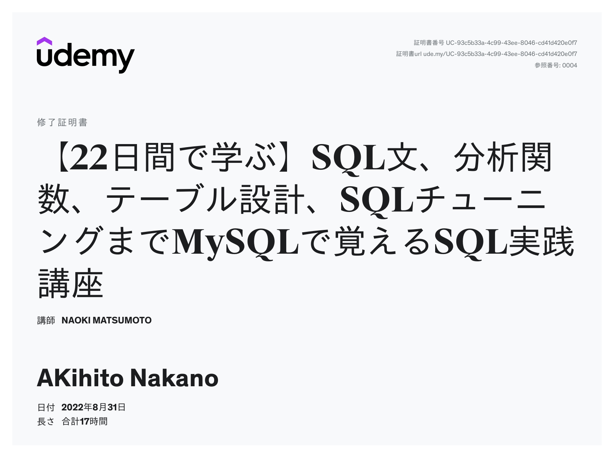
</div>

## 10. 今後の学習
