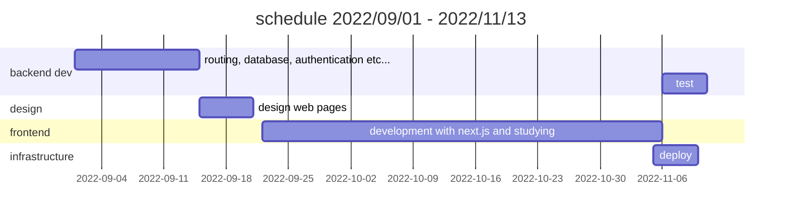

# レシピ検索 WEB アプリケーション　【Next.js / React / Node.js / TypeScript / MongoDB / Docker / GCP / Vercel / Render】

## はじめに

---

レシピ検索アプリーション Good Food を解説した記事となります。

---

### レシピを検索して投稿、交流できるウェブアプリケーション【GOOD FOOD]

主な使用技術はフロントエンドに Next.js/TypeScript、バックエンドに Node.js/TypeScript、データベースに MongoDB、ストレージに GCP の Cloud Storage、コンテナ作成に Docker、デプロイサービスはフロントエンドを Vercel、バックエンドは GCP の Cloud Run または Render を使用。

### 目次

1. アプリケーションの概要
2. 企画
3. スケジュール
4. デザイン
5. 前回の反省点
6. アプリの機能
7. 使用した技術スタック
8. 使用ツール
9. 努力した点、難しかった実装
10. 実装予定の機能
11. どのように学習したか
12. 今後の学習

### 開発者について

---

- 12 年間コンピューターグラフィックスを使用した業界で映画や、TV、CM、ゲーム映像などの仕事に従事していました
- 趣味で 4，5 年程度 UNREAL ENGINE を使用したゲーム開発をしており、iOS に公開した経験もあります
- 2022 年から本格的にプログラミングにのめり込み転職も検討中
- 一歳になる子どもがいます
- 以前台湾に 2 年ほど仕事で住んでいたことがあり中国語を話すことができます

## 1. アプリの概要

---

- 登録してログインしてみよう
- レシピを登録する
- ページを作成する
- レシピを印刷する

web サイトはこちら

👉 [https://good-food-one.vercel.app/](https://good-food-one.vercel.app/)

Good Food はレシピを投稿しお気に入りのレシピを保存、クリエイターをフォローすることができるアプリケーションです。
企画の項目で詳しく述べますがレシピの内容を印刷して使うことを目的として開発したので印刷に特化したレイアウトで出力できます。

### まずは登録してみよう

アカウント名、メールアドレス、パスワードを送信すると登録したメールアドレスに確認のメールが届きます（現在はメール送信サービスを中断していますのでそのままログインすることが可能です）。
登録後はログインしてみましょう！ 👏👏👏

### レシピを登録する

**記入項目は**

- レシピのタイトル
- レシピの説明
- 画像のアップロード
- 調理時間
- 材料と分量
  - 複数作成することが可能です
- 調味料と分量
  - 複数作成することが可能です
- 手順
- タグ

レシピを登録したら自分のレシピを確認してみましょう！
レシピに対してコメントすることもできます。

### ページを作成する

#### ページ機能とは？

ページとは複数のレシピをグループ化する機能です。
ページという名前から一枚のページ（A4 用紙を想定）にレシピを詰め込んで印刷、または PDF にして使用します。
分割数は現在 1, 4, 6 の 3 種類のみとなっています。

### レシピを印刷する

**６分割の場合**

**4 分割の場合**

## 2. 企画

---

- きっかけ
  - 印刷できるサイトはないのか
  - chrome の印刷オプションで分割レイアウトは可能では？
- コンセプト

### きっかけ

このレシピ検索アプリケーションを作ろうと行動したきっかけは私の妻が料理をしている際にそのとき使用していたレシピ検索アプリの不満からでした。

- レシピをノートに全部手書きすることは面倒

- 料理をしているときにスマートフォンを開きたくない

  - 料理をしているときは手が濡れていたり汚れているため 画面を触りたくない
  - スマホの画面は一定時間経過すると画面がオフになるためその度に立ち上げるのが面倒
  - 自分のメモが記入できない

- 自分のレシピノートが作成したい
  - 大きいノートは台所では邪魔になる為小さいノート、A6 サイズに貼り付けできるサイズが良い
  - メモができるある程度の余白が欲しい

#### 印刷できるサイトはないのか？

印刷できるサイトはありますが基本的に単品のレシピのみで A4 サイズに印刷するサイズのみを取り扱っているところがほとんどでした。

#### 印刷のオプションで（chrome では可能）一枚あたりのページ数を変更すれば分割したレイアウトをわざわざ作成する必要はないのではないか？

その通りだと思います。ただこの方法だと元々 A4 でレイアウトしていたページを縮小することになるので分割数によっては文字が非常に小さくなります。

### コンセプト

以上の内容を含めてその他の要望をまとめる以下のようになりました

**レシピを印刷して自分のマイレシピノートを作成しよう！**

- 印刷ができる
- 印刷のオプションがある
  - 分割数のオプション
- 印刷ができればそれ以外はシンプルなものでよい
- 複雑な機能は必要ない
- 綺麗で見易いサイト

最初の設計段階でフォローしているユーザー同士、メッセージを送ることができる機能も考えておりました。そのような機能は必要ないと判断されたため、ボツにしました。

## 3. スケジュール

---

スケジュールは 9 月の頭から開発を開始。当初の予定では１ヶ月で終わらせることを目標にしていましたが、新機能を使用するという目的があったため勉強の時間に費やす時間が増え結果的には 2 ヶ月程度かかりました。この 2 ヶ月はあくまでアプリケーションの機能開発の時間であるため、デプロイメント、テストの時間は含まれておりません。

## 4. デザイン

---

- デザインは **AdobeXD** を使用して大まかなデザイン案を作成
- 当初はグラデーションを使用したリッチなデザインを考えておりましたがあまり合わないと感じたためポップ寄りに変更しました。
- 配色は赤と白をベースに緑をアクセントとしたデザインで最終的には落ち着きました。

### Web サイト全体図

- 上部の縦長サイズはモバイル用レイアウト

#### レシピカードの構想案

#### ホームの構想案

#### モバイルサイトの構想案、全体図

#### 印刷時のレイアウト構想案

左から 1 分割、4 分割、6 分割

#### 全体のバランス調整チェック、配色、ボタンデザイン

## 5. 前回の反省点

---
